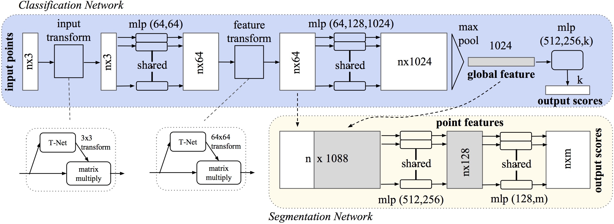

>该模块定义了语义分割网络。

## class get_model(nn.Module)

```python
class get_model(nn.Module):
    def __init__(self, num_class):
        super(get_model, self).__init__()
        self.k = num_class
        self.feat = PointNetEncoder(global_feat=False, 
                                    feature_transform=True, channel=9)
        self.conv1 = torch.nn.Conv1d(1088, 512, 1)
        self.conv2 = torch.nn.Conv1d(512, 256, 1)
        self.conv3 = torch.nn.Conv1d(256, 128, 1)
        self.conv4 = torch.nn.Conv1d(128, self.k, 1)
        self.bn1 = nn.BatchNorm1d(512)
        self.bn2 = nn.BatchNorm1d(256)
        self.bn3 = nn.BatchNorm1d(128)

    def forward(self, x):
        batchsize = x.size()[0]
        n_pts = x.size()[2]
        x, trans, trans_feat = self.feat(x)
        x = F.relu(self.bn1(self.conv1(x)))
        x = F.relu(self.bn2(self.conv2(x)))
        x = F.relu(self.bn3(self.conv3(x)))
        x = self.conv4(x)
        x = x.transpose(2,1).contiguous()
        x = F.log_softmax(x.view(-1,self.k), dim=-1)
        x = x.view(batchsize, n_pts, self.k)
        return x, trans_feat
```

- feat函数表示特征提取网络，设置`global_feat=False`，feat函数最终返回的是`n*1088`的矩阵，其每行既包含每个点的局部特征，也包含改点云的全局特征。
- forward函数首先将输入的`x`经过特征提取网络，然后经过四个全连接层，将每个点的特征降到`K`，`K`为语义分割总的类别数。
- 为什么第四个全连接层不需要经过BN和Relu。
- 然后使用`transpose()`函数将`B*K*N`转置为`B*N*K`，并使用contiguous函数保证该矩阵在存储空间中连续。**为什么要保证连续呢？**
- `x.view(-1,self.k)`将矩阵变成`BN*k`的二维矩阵，每一行为某个点的预测结果，所有行对应所有点云的所有点。
- 将tensor转换为二维矩阵的是为了对所有点的预测进行统一的log_softmax，其相对于softmax的好处可以见[博客](https://blog.csdn.net/m0_37477175/article/details/79686164)。
- 最后再将log_softmax得到的二维矩阵转换回`B*N*K`的tensor。

## class get_loss(torch.nn.Module)

> 此类定义了语义分割的loss。

```python
class get_loss(torch.nn.Module):
    def __init__(self, mat_diff_loss_scale=0.001):
        super(get_loss, self).__init__()
        self.mat_diff_loss_scale = mat_diff_loss_scale

    def forward(self, pred, target, trans_feat, weight):
        loss = F.nll_loss(pred, target, weight = weight)
        mat_diff_loss = feature_transform_reguliarzer(trans_feat)
        total_loss = loss + mat_diff_loss * self.mat_diff_loss_scale
        return total_loss
```

- loss：语义分割的分类错误
- mat_diff_loss：约束feature transformation的正交性
- mat_diff_loss_scale：mat_diff_loss的权重

