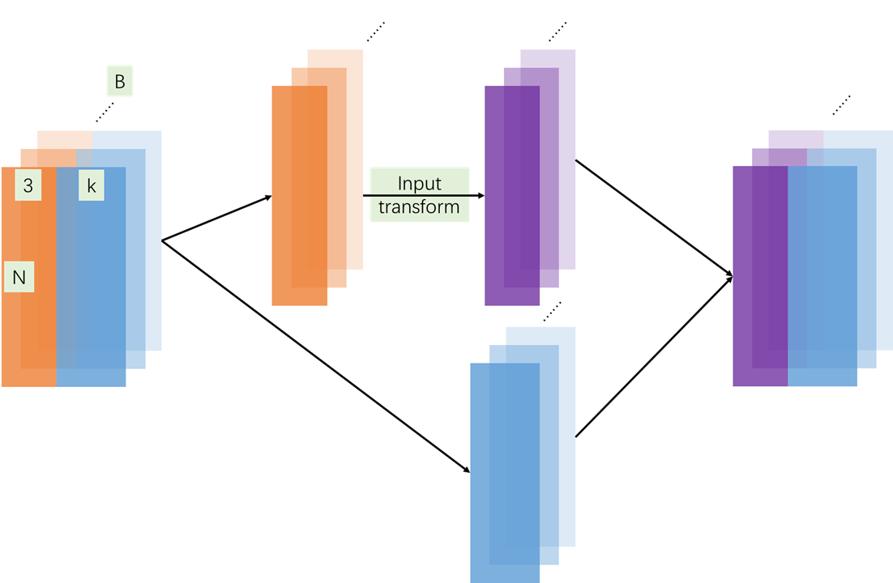

## class STN3d(nn.Module)

- 功能：这是pointnet的第一个T-net，即input transform。其输入为一个batch的点云坐标，输出为batchsize个3*3的transformation matrix。

  

- 完整代码

  ```python
  class STN3d(nn.Module):
      '''
          T-Net for 3d points
      '''
      def __init__(self, channel):
          super(STN3d, self).__init__()
          self.conv1 = torch.nn.Conv1d(channel, 64, 1)
          self.conv2 = torch.nn.Conv1d(64, 128, 1)
          self.conv3 = torch.nn.Conv1d(128, 1024, 1)
          self.fc1 = nn.Linear(1024, 512)
          self.fc2 = nn.Linear(512, 256)
          self.fc3 = nn.Linear(256, 9)
          self.relu = nn.ReLU()
  
          self.bn1 = nn.BatchNorm1d(64)
          self.bn2 = nn.BatchNorm1d(128)
          self.bn3 = nn.BatchNorm1d(1024)
          self.bn4 = nn.BatchNorm1d(512)
          self.bn5 = nn.BatchNorm1d(256)
  
      def forward(self, x):
          batchsize = x.size()[0]
          x = F.relu(self.bn1(self.conv1(x)))
          x = F.relu(self.bn2(self.conv2(x)))
          x = F.relu(self.bn3(self.conv3(x)))
          x = torch.max(x, 2, keepdim=True)[0]
          x = x.view(-1, 1024)
  
          x = F.relu(self.bn4(self.fc1(x)))
          x = F.relu(self.bn5(self.fc2(x)))
          x = self.fc3(x)
  
          # iden is a Variable with `batchsize` rows 
          # of [1, 0, 0, 0, 1, 0, 0, 0, 1]
          iden = Variable(torch.from_numpy(np.array([1, 0, 0, 0, 1, 0, 0, 0, 1]).astype(np.float32))).view(1, 9).repeat(
              batchsize, 1)
          if x.is_cuda:
              iden = iden.cuda()
          x = x + iden # for what?
          x = x.view(-1, 3, 3)
          # return a collection of transform matrix. Why it have `batchsize` rows?
          return x
  
  ```

  - 代码比较简单，就是先卷积，再max pooling，最后接几个全连接得到9个值作为转换矩阵。
  - ==不清楚的部分==
    - ==为什么要将网络输出的转换矩阵加上一个单位矩阵？==
    - ==为什么输出的是batchsize个转换矩阵？==我们希望T-Net的作用是能够根据输入的点云能够输出其合适的转换矩阵，输出的转换矩阵应该是根据不同的点云而不同的。

## class STNkd(nn.Module):

- 功能：这是pointnet的第二个T-net，feature transform。其输入为一个batch的经过一层卷积后的全部64维特征（注意，上一个T-net的作用对象仅为输入点云的三维坐标，不包括点云的其他特征），输出为batchsize个3*3的transformation matrix。

  

- 代码

  ```python
  class STNkd(nn.Module):
      '''
          T-Net for kd points
      '''
      def __init__(self, k=64):
          super(STNkd, self).__init__()
          self.conv1 = torch.nn.Conv1d(k, 64, 1)
          self.conv2 = torch.nn.Conv1d(64, 128, 1)
          self.conv3 = torch.nn.Conv1d(128, 1024, 1)
          self.fc1 = nn.Linear(1024, 512)
          self.fc2 = nn.Linear(512, 256)
          self.fc3 = nn.Linear(256, k * k)
          self.relu = nn.ReLU()
  
          self.bn1 = nn.BatchNorm1d(64)
          self.bn2 = nn.BatchNorm1d(128)
          self.bn3 = nn.BatchNorm1d(1024)
          self.bn4 = nn.BatchNorm1d(512)
          self.bn5 = nn.BatchNorm1d(256)
  
          self.k = k
  
      def forward(self, x):
          batchsize = x.size()[0]
          x = F.relu(self.bn1(self.conv1(x)))
          x = F.relu(self.bn2(self.conv2(x)))
          x = F.relu(self.bn3(self.conv3(x)))
          x = torch.max(x, 2, keepdim=True)[0]
          x = x.view(-1, 1024)
  
          x = F.relu(self.bn4(self.fc1(x)))
          x = F.relu(self.bn5(self.fc2(x)))
          x = self.fc3(x)
          iden = Variable(torch.from_numpy(np.eye(self.k).flatten().\
                          astype(np.float32))).view(1, self.k * self.k)\
          				.repeat(batchsize, 1)
          if x.is_cuda:
              iden = iden.cuda()
          x = x + iden
          x = x.view(-1, self.k, self.k)
          return x
  ```

  - 内容和上一个T-net基本没区别，除了输入输出的维度不一样

  ## class PointNetEncoder(nn.Module):

- 功能：pointnet中提取点云全局特征的网络部分。

  

  - 网络输入为B\*D\*N的张量，B为batchsize，D为点云中每一个点的维度，N为每个点云包含的点的数量。

    ```python
    B, D, N = x.size()
    ```

  - 然后将B\*D\*N的张量输入到第一个T-Net中，得到B个3*3的转换矩阵，将该矩阵与点云中每个点的三维坐标进行矩阵乘法，但是要保证点云的其他特征不变

    ```python
            trans = self.stn(x)
            x = x.transpose(2, 1)
            if D > 3:
                feature = x[:, :, 3:]
                x = x[:, :, :3]
            x = torch.bmm(x, trans) # batch matrix pow matrix
            if D > 3:
                x = torch.cat([x, feature], dim=2)
            x = x.transpose(2, 1) # transpose tensor from BND to BDN
    ```

    - 第1行是将B\*D\*N的张量输入到T-Net中，得到B个3*3的转换矩阵。

    - 第2行是将张量的D维和N维进行转置，保证batch中每个item为一个点云的N个点的D位特征。

    - 3~5行将点云中每个点的坐标和特征分开，方便对点云中每个点的坐标做transformation。

    - 第6行使用bmm函数将每个batch中的每个点云与对应的其输入T-Net得到的转换矩阵做矩阵乘法，得到每个点云转换后的结果。

    - 7~8行表示如果点云还包含其他特征，则将这些特征重新concatenate到每个点的后面，整个过程中没有改变点云的每个点的特征。

    - 第9行将张量转换为原来的B\*D\*N的shape。

    - 整个过程的示意图如下：

      

  - 接下来是一个卷积层，

    ```python
    x = F.relu(self.bn1(self.conv1(x)))
    ```

    - 其中

