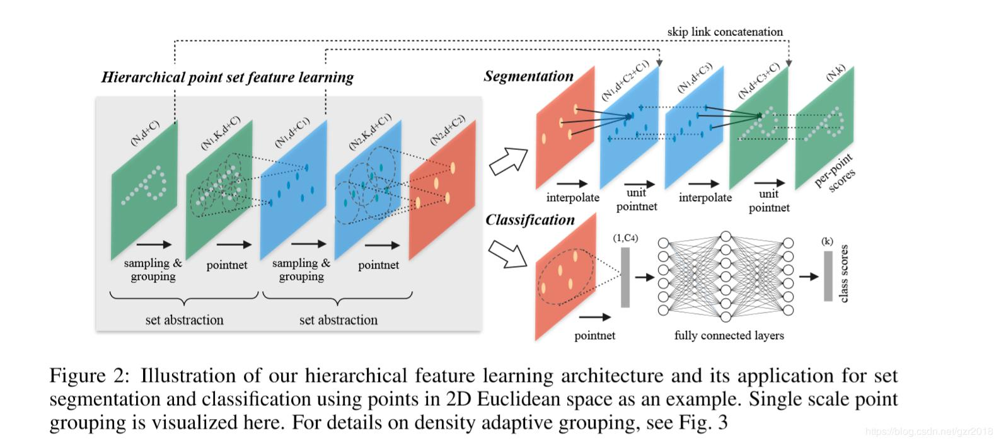

## def pc_normalize(pc):

```python
def pc_normalize(pc):
    centroid = np.mean(pc, axis=0)
    pc = pc - centroid
    m = np.max(np.sqrt(np.sum(pc**2, axis=1)))  # 球半径，如何理解代码？
    pc = pc / m
    return pc
```

- 该函数用于对输入点云（pc）做坐标归一化。公式为：
  $$
  p_{normalize} = \frac{p-p_{mean}}{max {||(p_i-p_{mean})-(p_j-p_{mean})||_2}},\quad i,j=1,2...n
  $$

- 需要注意的是`pc**2`代表的是张量中的每个元素进行平方运算，由于第三行已经对所有点减去了点云均值，相当于将点云的中心点移动到了坐标轴的中心，这样求得的平方代表的是每个点到零点的距离，也就是每个点到点云中心点的距离。取所有点到点云中心点的最远距离作为点云的球半径。

- `pc = pc / m`将所有点的坐标归一化到0~1。

## def square_distance(src, dst)

```python
def square_distance(src, dst):
    B, N, _ = src.shape
    _, M, _ = dst.shape
    dist = -2 * torch.matmul(src, dst.permute(0, 2, 1))
    dist += torch.sum(src ** 2, -1).view(B, N, 1)
    dist += torch.sum(dst ** 2, -1).view(B, 1, M)
    return dist
```

- 该函数用于在ball query过程中确定每一个点距离采样点的距离。函数返回src点云中的每一个点与dst点云中的每一个点之间的距离，使用一个`N*M`的矩阵进行表示。返回的矩阵的shape为`B*N*M`，其中第`i`个`N*M`矩阵为src中第`i`个点云矩阵与dst中第`i`个点云矩阵之间的距离矩阵。

- B = batch size，N = src中点的数量，M = dst中点的数量。

- 计算src中的第`i`个二维矩阵与dst中的第`i`个矩阵之间的点与点的平方距离。

- `dist = -2 torch.matmul(src, dst.permute(0, 2, 1))`计算了
  $$
  src^T * dst = x_n*x_m + y_n*y_m + z_n*z_m
  $$

- 4-6行计算得到了一个`M*N`的矩阵，其每个元素为src点云中的一个点$p_n=(x_n,y_n,z_n)$与$p_m=(x_m,y_m,z_m)$两个点的欧式距离（省去了开平方）。
  $$
  (x_n - x_m)^2 + (y_n - y_m)^2 + (z_n - z_m)^2=\\x_n^2+y_n^2+y_n^2+z_n^2+x_m^2+y_m^2+z_m^2-2x_nx_m-2y_ny_m+z_nz_m
  $$

## def index_points(points, idx)

```python
def index_points(points, idx):
    device = points.device
    B = points.shape[0]
    view_shape = list(idx.shape)
    view_shape[1:] = [1] * (len(view_shape) - 1)
    repeat_shape = list(idx.shape)
    repeat_shape[0] = 1
    batch_indices = torch.arange(B, dtype=torch.long).to(device) \
    			   .view(view_shape).repeat(repeat_shape)
    new_points = points[batch_indices, idx, :]
    return new_points
```

- 按照输入的点云数据points（B,N,C），和点的索引idx（B, S），返回点云中指定index的点组成的子点云。

## def farthest_point_sample(xyz, npoint)

```python
def farthest_point_sample(xyz, npoint):
    device = xyz.device
    B, N, C = xyz.shape
    centroids = torch.zeros(B, npoint, dtype=torch.long).to(device)
    distance = torch.ones(B, N).to(device) * 1e10
    farthest = torch.randint(0, N, (B,), dtype=torch.long).to(device)
    batch_indices = torch.arange(B, dtype=torch.long).to(device)
    for i in range(npoint):
        centroids[:, i] = farthest
        centroid = xyz[batch_indices, farthest, :].view(B, 1, 3)
        dist = torch.sum((xyz - centroid) ** 2, -1)
        mask = dist < distance
        distance[mask] = dist[mask]
        farthest = torch.max(distance, -1)[1]
    return centroids
```

- 最远点采样函数。从一个输入点云中按照最远距离原则采样npoint个点。所谓最远距离原则就是每次在选择一个新的采样点时，选择点云中距离当前已经被选取的所有采样点最远的点，这里的距离使用的是一个点距离所有采样点的最短平方欧氏距离。

- 几个比较重要的变量：

  - centroids：存储`B*npoint`个centroid的**index**，每个点根据最远距离原则进行采样。最后的for循环的每一层都会填充一列，即为每个点云采样一个新的cnetroid。
  - distance：shape为`(B*N)`，存储所有点距离所属点云的所有采样点的最近距离。在每一轮for循环里会计算所有点到新采样点的距离，如果新距离小于distance中存储的距离，就用更小的新距离替换掉 。
  - farthest：shape为`(B,)`，记录距离当前所有采样点最远的点的**index**。其在一开始被随机为0~N-1的整数，表示在点云中随机选择一个点作为第一个centroid。其在for循环的最后更新为distance张量中每个点云的最大值的index。

- 该函数的伪代码如下：

  ```python
  def farthest_point_sample(xyz, npoint):
      # xyz为输入的点云，shape为(B,N,3)，npoint为想要采样的点的数量
      B,N ← batch size, 每个点云中包含的点数
      centroid ← B*npoint大小的0矩阵
      distance ← B*N大小的矩阵，初始化每个元素为无穷大
      farthest ← 长度为B的向量，每个元素为0~N-1的随机数
      batch_indices ← 长度为B的顺序向量，其中的值依次为0,1,2......
      for i from 0 to npoint:
          centroids的第i列 ← farthest（距离当前所有采样的距离最大的点的index，总共B个）
          centroid ← farthest指定的index的点的坐标，总共B个
          dist ← 所有点到所属的centroid的距离，B*N大小的矩阵
          mask ← B*N大小的矩阵，对应位置的dist<distance，则为1
          对于mask为1的位置，使用dist在该位置的值更新distance在该位置的值
          farthest ← distance每一行的最大值（代表该点云中距离所有采样点的最大距离）
  ```

## def query_ball_point(radius, nsample, xyz, new_xyz)

```python
def query_ball_point(radius, nsample, xyz, new_xyz):
    device = xyz.device
    B, N, C = xyz.shape
    _, S, _ = new_xyz.shape
    group_idx = torch.arange(N, dtype=torch.long).to(device).view(1, 1, N) \ 
    			.repeat([B, S, 1])
    sqrdists = square_distance(new_xyz, xyz)
    group_idx[sqrdists > radius ** 2] = N
    group_idx = group_idx.sort(dim=-1)[0][:, :, :nsample]
    group_first = group_idx[:, :, 0].view(B, S, 1).repeat([1, 1, nsample])
    mask = group_idx == N
    group_idx[mask] = group_first[mask]
    return group_idx
```

- 该函数用于寻找点云xyz在以new_xyz中的点为圆心，radius为半径的球形区域中的nsample个点。
- 重要变量介绍
  - `radius`：float，球邻域半径
  - `nsample`：int，每个球邻域采样的点数
  - `xyz`：shape = (B,N,3)，输入的B个点云
  - `new_xyz`：shape = (B,S,3)，每个点云有S个球邻域需要查询。
- 第七行，`sqrdists`为一个shape为(B,S,N)的张量，记录了每个`centroid`与所属点云的其他点的距离。
- 第六行，`group_idx`被初始化为一个`B*S*N`的矩阵（与`sqrdists`形状相同），其包含`B*S`个0~N-1的顺序向量；第八行，将`sqrdists`中距离小于半径的位置的`group_idx`的值更新为`N`；第九行，将`group_idx`从小到大排序，将那些距离centroid大于半径的点排在后面，然后取前`nsample`个点作为球邻域的采样点。
- 上面这种采样方式假定每个球邻域中的点不少于`nsample`个点，否则就会取到半径外的点。第10~13行就是为了解决这个问题，解决方法是将采样到的半径外的点替换成距离centroid最近的点（==我觉得不合理==）。
- 第十行，`group_first`是一个`B*S*nsample`的张量，B个二维矩阵包含S个centroid，某一列中的元素是重复的，均为距离 centroid最近的点的index。
- 第十一行得到采样到半径外的点的index。
- 第十二行将这些半径外的点更新为距离centroid最近的点的index。

## def sample_and_group()

```python
def sample_and_group(npoint, radius, nsample, xyz, points, returnfps=False):
    B, N, C = xyz.shape
    S = npoint
    fps_idx = farthest_point_sample(xyz, npoint) # [B, npoint, C]
    new_xyz = index_points(xyz, fps_idx)
    idx = query_ball_point(radius, nsample, xyz, new_xyz)
    grouped_xyz = index_points(xyz, idx) # [B, npoint, nsample, C]
    grouped_xyz_norm = grouped_xyz - new_xyz.view(B, S, 1, C)  # group到的点减去中心点
    if points is not None:
        grouped_points = index_points(points, idx)
        new_points = torch.cat([grouped_xyz_norm, grouped_points], dim=-1)
    else:
        new_points = grouped_xyz_norm
    if returnfps:
        return new_xyz, new_points, grouped_xyz, fps_idx
    else:
        return new_xyz, new_points
```

- Sampling + Grouping主要用于将整个点云分散成局部的group，对每一个group都可以用PointNet单独地提取局部的全局特征。
- 一些重要的参数介绍：
  - npoint：在一个点云中需要采样npoint个最远点，也表示一个点云分为多少组。
  - radius：球邻域半径
  - nsample：每个球邻域采样的点数，作为一个group。
  - xyz：[B, N, 3]，输入点云的位置信息
  - points：[B, N, D]，输入点云的特征信息。一个完整的点云应当是(B,N,3+D)的。
  - new_xyz：[B, npoint, 3]，每个点云采样得到的npoint个centroid的坐标 。
  - new_points：[B, npoint, nsample, 3+D]，比上面的点云多了特征。
  - idx：[B, npoint,nsample]，代表npoint个球形区域中每个区域的nsample个采样点的索引。
- 第四行得到`B*npoint`个centroid的index，这里可以不用管C，因为它必是3，所以可以直接用3代替就好。
- 第五行得到这些centroid的坐标。第六行和第七行在这些centroid的球邻域中采样nsample个点，已经得到了[B, npoint, nsample, C]的张量了。
- 第八行将每个group的点减去对应的centroid坐标，将每个group的中心移动到坐标原点。这样就已经将原来的整个点云分成很多组点云，并且将这些点云都移动到坐标系原点，这样每个group都可以使用pointnet进行全局特征提取了。
- 由于上面的group操作只关心了点的坐标，九到十三行是判断是否要考虑点的其他特征，如果考虑，那就用sample的index找到对应的特征行，拼接到group到的点云上去。

## def sample_and_group_all()

```python
def sample_and_group_all(xyz, points):
    device = xyz.device
    B, N, C = xyz.shape
    new_xyz = torch.zeros(B, 1, C).to(device)
    grouped_xyz = xyz.view(B, 1, N, C)
    if points is not None:
        new_points = torch.cat([grouped_xyz, points.view(B, 1, N, -1)], dim=-1)
    else:
        new_points = grouped_xyz
    return new_xyz, new_points
```

- 这个函数将整个点云作为一个group，(B,1,C)中的1代表的就是整个点云只有一个group。
- 这个函数用在classification网络的的第一层，见下图。可以将所有点作为一个整体的global feature。
- new_xyz仅仅是一个(B, 1, 3)的零矩阵，代表每个点云仅有一个centroid，为坐标零点。

## class PointNetSetAbstraction(nn.Module)

```python
class PointNetSetAbstraction(nn.Module):
    def __init__(self, npoint, radius, nsample, in_channel, mlp, group_all):
        pass
    def forward(self, xyz, points):
        pass
```



- 这个类用于实现pointnet++中set abstraction的部分。该部分的流程式首先通过**sampling & grouping**操作将点云分成若干个组，每个组经过pointnet（舍弃了T-Net部分）。

- `__init__`函数部分：

  ```python
      def __init__(self, npoint, radius, nsample, in_channel, mlp, group_all):
          super(PointNetSetAbstraction, self).__init__()
          self.npoint = npoint
          self.radius = radius
          self.nsample = nsample
          self.mlp_convs = nn.ModuleList()
          self.mlp_bns = nn.ModuleList()
          last_channel = in_channel
          for out_channel in mlp:
              self.mlp_convs.append(nn.Conv2d(last_channel, out_channel, 1))
              self.mlp_bns.append(nn.BatchNorm2d(out_channel))
              last_channel = out_channel
          self.group_all = group_all
  ```

  - 这里主要是定义了两个`ModuleList`，`mlp_convs`是一个包含了若干层卷积操作的列表；`mlp_bns`是一个包含了若干个BN操作的列表。
  - `mlp`是一个`int`列表，比如[128,128 ,256] ，表示三个隐藏层的feature map的数量。
  - **这里为什么使用Conv2d？**

- `forward`函数部分

  ```python
  def forward(self, xyz, points):
      xyz = xyz.permute(0, 2, 1)
      if points is not None:
          points = points.permute(0, 2, 1)
  	if self.group_all:
  		new_xyz, new_points = sample_and_group_all(xyz, points)
  	else:
  		new_xyz, new_points = sample_and_group(self.npoint, \ 
                                      self.radius, self.nsample, xyz, points)
  	new_points = new_points.permute(0, 3, 2, 1) # [B, C+D, nsample,npoint]
      for i, conv in enumerate(self.mlp_convs):
          bn = self.mlp_bns[i]
          new_points =  F.relu(bn(conv(new_points)))
      new_points = torch.max(new_points, 2)[0]
      new_xyz = new_xyz.permute(0, 2, 1)
      return new_xyz, new_points
  ```

  - 第二行首先将点云坐标数据从(B,3,N)转换为(B,N,3)。三四行也是同样的操作。
  - 五到九行进行点云的**sampling & grouping**操作，得到的`new_xyz`是为每个点云sampling的npoint个centroid，如果`self.group_all==True`，则只取一个坐标系中心点作为centroid。得到的new_points为点云group后的结果，其shape为(B, npoint, nsample, 3+D)，其中npoint为每个点云的centroid数量，nsample为每个centroid以radius为半径的球邻域采样的点数量。
  - 第十行将**sampling & grouping**得到的点云组转换为卷积网络能够接收的张量维度顺序。**这个顺序是怎么知道的？**
  - for循环就是将点云组经过若干层的卷积、Relu和BN运算。**需要注意的是，input为点云的坐标加特征，而不是仅用特征进行运算。**
  - 十四行再对运算结果做一个最大池化得到pointnet提取的点云组中每个小点云全局特征。
  - 最后返回的是：**sampling**得到的centroid矩阵`new_xyz`，其用于记录每个小点云在原来的点云中的位置；**sampling & grouping**后的小点云经过pointnet提取到的全局特征。
  - 这样，我们在大点云中选取了npoint个相距很远的centroid，然后再以他们为中心采样了球形邻域的点集，并使用pointnet提取了这些点集的全局特征。最终得到的结果是一些centroid，和每个centroid对应的一个全局特征。这个操作就像是在图像中选择一个卷积中心和合适的感受野并进行卷积一样。

## class PointNetSetAbstractionMsg(nn.Module)

```python
class PointNetSetAbstractionMsg(nn.Module):
    def __init__(self, npoint, radius_list, nsample_list, in_channel, mlp_list):
        pass
    def forward(self, xyz, points):
        pass
```

- 使用MSG（multi-scale grouping）的set abstration。MSG的思想如下图所示。其相较于普通的SA结构，对ball query的结果又进行了不同尺度的点云特征提取与拼接。

  

- `__init__`函数部分

  ```python
      def __init__(self, npoint, radius_list, nsample_list, in_channel, mlp_list):
          super(PointNetSetAbstractionMsg, self).__init__()
          self.npoint = npoint
          self.radius_list = radius_list
          self.nsample_list = nsample_list
          self.conv_blocks = nn.ModuleList()
          self.bn_blocks = nn.ModuleList()
          for i in range(len(mlp_list)):
              convs = nn.ModuleList()
              bns = nn.ModuleList()
              last_channel = in_channel + 3
              for out_channel in mlp_list[i]:
                  convs.append(nn.Conv2d(last_channel, out_channel, 1))
                  bns.append(nn.BatchNorm2d(out_channel))
                  last_channel = out_channel
              self.conv_blocks.append(convs)
              self.bn_blocks.append(bns)
  ```

  - npoint：与普通的SA结构中的相同。
  - radius_list：比如等于[0.2,0.4,0.8]，表示选取的三个嵌套球的半径。
  - nsample_list：比如等于[32,64,128]，三个嵌套球里采样的点数。
  - in_channel：输入的点云中每个点的特征维度。pointnet++中，经过SA结构提取特征后依然可以看成是一个点云，只不过每个点的特征包含了这些点周围的信息。
  - **`last_channel = in_channel + 3`是什么意思？难道是将每个点加上它的坐标信息？**
  - mlp_list：比如等于[[64,64,128],[128,128,256],[128,128,256]]，其中第i个list对应第i个半径的卷积层列表。

- `forward`函数部分

  ```python
      def forward(self, xyz, points):
          xyz = xyz.permute(0, 2, 1)
          if points is not None:
              points = points.permute(0, 2, 1)
          B, N, C = xyz.shape
          S = self.npoint
          new_xyz = index_points(xyz, farthest_point_sample(xyz, S))  # 最远点采样
          new_points_list = []  # 将不同半径下的点云特征保存在new_points_list
          for i, radius in enumerate(self.radius_list):
              K = self.nsample_list[i]
              group_idx = query_ball_point(radius, K, xyz, new_xyz)
              grouped_xyz = index_points(xyz, group_idx)
              grouped_xyz -= new_xyz.view(B, S, 1, C)
              if points is not None:
                  grouped_points = index_points(points, group_idx)
                  grouped_points = torch.cat([grouped_points, grouped_xyz], dim=-1)
              else:
                  grouped_points = grouped_xyz
              grouped_points = grouped_points.permute(0, 3, 2, 1)  # [B, D, K, S]
              for j in range(len(self.conv_blocks[i])):
                  conv = self.conv_blocks[i][j]
                  bn = self.bn_blocks[i][j]
                  grouped_points =  F.relu(bn(conv(grouped_points)))
              new_points = torch.max(grouped_points, 2)[0]  # [B, D', S]
              new_points_list.append(new_points)
          new_xyz = new_xyz.permute(0, 2, 1)
          new_points_concat = torch.cat(new_points_list, dim=1)
          return new_xyz, new_points_concat
  ```

  - 重要变量介绍

    - xyz: input points position data, [B, C, N]
    - points: input points feature data, [B, D, N]

    - new_points_list

  - 第七行，还是首先在输入点云中采样了npoint个centroid。

  - 在采样到centroid之后，使用两个for循环分别遍历不同的球半径以及不同的卷积层。需要注意的是，不同的球半径在提取特征的时候并不共享网络层，而是使用不同的卷积层进行卷积。**这样做有什么特殊的用意吗？**

  - 第十一、十二行，在点云中找球形邻域的点作为group。

  - 十三行将这些group的centroid移动到零点。

  - 十四到十九行是将点云的其他特征concat到group的每个点后面。作为神经网络的输入。

  - 接下来就使用卷积层提取每个group的特征，这里对于第i个半径，使用`conv_blocks`中第i个卷积网络提取特征。

  - 二十七行将不同半径提取到的特征concat在一起，这就是MSG的思想。

## class PointNetFeaturePropagation(nn.Module)

```python
class PointNetFeaturePropagation(nn.Module):
    def __init__(self, in_channel, mlp):
        pass
    def forward(self, xyz1, xyz2, points1, points2):
        pass
```

- 该函数定义了Segementation网络需要使用的interpolate和unit pointnet运算。	

- `__init__`函数：

  ```python
      def __init__(self, in_channel, mlp):
          super(PointNetFeaturePropagation, self).__init__()
          self.mlp_convs = nn.ModuleList()
          self.mlp_bns = nn.ModuleList()
          last_channel = in_channel
          for out_channel in mlp:
              self.mlp_convs.append(nn.Conv1d(last_channel, out_channel, 1))
              self.mlp_bns.append(nn.BatchNorm1d(out_channel))
              last_channel = out_channel
  ```

  - 比较简单，就是简单的卷积层和BN层的定义，但是需要注意的是，这里又改用了一维卷积。

- `forward`函数;

  ```python
      def forward(self, xyz1, xyz2, points1, points2):
          xyz1 = xyz1.permute(0, 2, 1)
          xyz2 = xyz2.permute(0, 2, 1)
          points2 = points2.permute(0, 2, 1)
          B, N, C = xyz1.shape
          _, S, _ = xyz2.shape
          if S == 1:
              interpolated_points = points2.repeat(1, N, 1)
          else:
              dists = square_distance(xyz1, xyz2)
              dists, idx = dists.sort(dim=-1)
              dists, idx = dists[:, :, :3], idx[:, :, :3]  # [B, N, 3]
              dist_recip = 1.0 / (dists + 1e-8)  # 距离越远的点权重越小
              norm = torch.sum(dist_recip, dim=2, keepdim=True)
              weight = dist_recip / norm  # 对于每一个点的群众再做一个全局的归一化
              interpolated_points = torch.sum(index_points(points2, idx) \
                                    * weight.view(B, N, 3, 1), dim=2)  # 获得插值点
          if points1 is not None:
              points1 = points1.permute(0, 2, 1)
              new_points = torch.cat([points1, interpolated_points], dim=-1)
          else:
              new_points = interpolated_points
          new_points = new_points.permute(0, 2, 1)
          for i, conv in enumerate(self.mlp_convs):
              bn = self.mlp_bns[i]
              new_points = F.relu(bn(conv(new_points)))
          return new_points
  ```

  - 重要变量介绍：

    - xyz1：[B,C,N]，完整的点云坐标数据。
    - xyz2：[B,C,S]，采样的centroid点坐标数据。
    - points1：[B, D, N]，完整点云的特征数据。
    - points2：[B, D, S]，采样的centroid点的特征数据。
    - 

  - interpolate过程：

    - 由于之前对于一个完整点云，我们在其中采样了一些centroid，并使用pointnet提取了这些cnetroid周围点云的全局特征。现在我们如果需要对点云进行segment，那就需要先得到那些没有提取到特征的点的特征，这里直接就用这些centroid的特征去插值得到其他点的特征，再进行segment。
    - 这里传入了两个点云，points1和points2，我们希望插值后points1中的非centroid点也有特征，即将points2从[B, D, S]插值到[B, D, N]
    - 分两种情况讨论，如果仅有一个centroid，那么就没办法通过插值得到其他采样点，也就无法上采样，这里采用的；如果有多个centroid，那就用线性插值进行上采样。
    - 第一种情况，仅有一个centroid，第八行直接将这个centroid的特征复制了N遍。N为xyz1中一个点云中点的数量。即其他的点的特征都和这个centroid的特征相同，也就代表了这些点会被centroid的是同一个类别的
    - 第二种情况，不止一个centroid，通过线性插值得到其他点的特征。
      - 第十行，获得了原本点云中的每个点距离所有centroid的距离。
      - 第十一行，按照每个点距离cnetroid的距离排序。
      - 第十二行，取距离每个点最近的三个centroid。**本身就是centroid的那些点基本不会受到其他最近的其他两个cnetroid影响，因为1.0 / + 1e-8会非常大，其他两个点的权重会被归一化到很小很小。**
      - 第十三到十五行，按照点到cnetroid的距离的倒数为每个centroid的插值权重。
      - 第十六行，点的特征值为最近邻的三个centroid的加权和。
    - 十八到二十二行将点云原来的特征与插值得到的特征进行拼接。
    - 最后再为插值后的点云进行一个MLP进一步提取特征。个人觉得，这里每个点经过拼接，既有原来点云中每个点的特征，这是较局部的特征，还有插值得到的特征，这个较全局的特征，将这两个特征直接拼接后再经过MLP提取高层特征，会既包含点云的局部特征，也包含其全局特征，加大segment的正确率。

    

