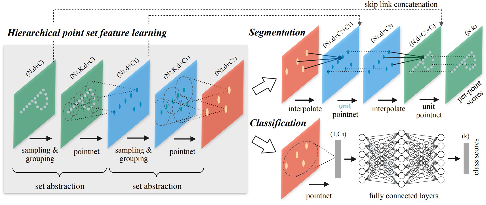

# PointNet++

> PointNet存在的问题是PointNet虽然提取了每个点的局部信息，但是这个局部信息十分有限，只有一个点。PointNet无法捕捉到点附近的局部结构信息，限制了其在细粒度（fine-grained）形状的点云的识别以及复杂场景中的应用。为了解决这个问题，PointNet++采用了一种嵌套式的点云分割方式，PointNet++提取点云特征的方式类似于二维图像使用CNN提取特征，其提取嵌套的邻域特征，使得特征更加丰富，具有更强的表征能力。另外，作者观察到真实采样到的点云的具有不同的稀疏程度，但是训练网络的时候使用的都是一种密度的点云，这就使得网络泛化到不同密度的点云上的能力变差。为了解决这一问题，作者在网络中加入了一些学习层去可适应地结合不同尺度的特征信息（**在哪？**）
>
> 另外PointNet中一个点云的全局特征是将所有**单个点**的稀疏高维特征信息的整合，生成的global  feature有限，且损失了一定的信息；PointNet++则是通过多层不断提取点云中嵌套区域的点云的特征，得到点云的global feature，具有更强的表征能力。

## Introduction

- 作者首先介绍了点云，包括其是什么、获取方式和特点。除此之外，作者着重强调了点云的另一个特点——the distance metric defines local neighborhoods that may exhibit different properties，也就是说，一个点周围的点的分布是该点的一个很重要的特征。这个特点很重要，其一是PointNet没有重视这个问题，其二是本文的重点就是针对该特征设计网络结构。

- 作者接下来直接指出了PointNet这一问题：The basic idea of PointNet is to learn a **spatial** encoding of each point and then aggregate all individual point feature to a global point cloud signature，也就是说，PointNet并没有提取到一个点的周围邻域的信息。接下来，作何使用二维图像上使用的CNN说明了global feature更应当是所有点的邻域特征的整合，而不是多有单个点的稀疏特征的组合。

  > 已经证明的是，在CNN中，浅层网络往往用于提取图像的低级语义信息，深层网络通过整合浅层网络提取到的低级信息具备了更强的抽象能力，从而能够提取图像中更抽象信息。

- 下面对比朴素的CNN与PointNet++从而介绍PointNet++的每一个步骤：

  | 步骤           | CNN                      | PointNet++                    |
  | -------------- | ------------------------ | ----------------------------- |
  | 网络的输入     | 固定大小图片             | 坐标归一到0~1的点云           |
  | 提取特征的中心 | 滑动窗口的中心点，有规律 | 随机选取的最远的n个点，无规律 |
  | 提取特征的方法 | 卷积                     | PointNet（不包含T-Net）       |
  |                |                          |                               |

- 对比CNN的传播过程，结合PointNet++的流程图，可以将PointNet++的传播过程总结如下：对于一个输入点云，先将其归一化到所有坐标在0~1之间，然后随机选择n个点作为提取特征的中心点，记录这些中心点的坐标值，使用PointNet提取以这些点为中心固定半径的邻域包含的所有点的特征（这里称之为local feature），得到的结果是这些中心点的坐标值和它们的local feature。随机选取中心点、提取中心点的local feature并组合成一组新的点云的过程称为sampling&grouping ，这个过程可以在点云上进行多次，就像CNN在图像是上进行多层卷积操作一样。

## Method and Code

### Hierarchical point set feature learning

Hierarchical point set feature learning是上图的左边模块，其由若干个set abstraction层组成，每个层的任务是提取该层中一组最远点的特征。每个set abstraction层包括三个子层：sampling、grouping、pointnet。

- sampling layer：从输入的n个点$\left\{ x_1,x_2,...,x_n\right\}$中依据farthest point sampling (FPS) 算法选取$m$个最远点$\left\{ x_{i1},x_{i2},...,x_{im}\right\}$，FPS算法的思想是每次选取一个新的点的时候都要保证其与所有已经选了的点的距离和最大。这样做的好处是可以根据输入点云自适应地选取合适的区域提取局部特征，不像图像的卷积网络只能在预设好的几个点提取局部特征。

-  grouping layer：根据输入点云和sampling layer抽取的$m$个点的坐标，得到$m$个局部点云。输入点云的shape为 $N \times (d\times C)$ ，$N$ 表示点的数量，$d=3$表示坐标维度，$C$表示点的特征维度（代码中显示：输入点云如果包含了点的法向量，则用坐标和法向量作为点云在第一层的特征，$C=6$；如果没有则只用坐标作为特征，$C=3$）。输出$m$个局部点云，shape为$m \times K \times (d+C)$，$K$表示一个局部点云中的点的数量。作者说不同的局部点云具有不同的$K$并不影响算法的进行，因为一层内所有点的特征维度相同，只要经过PointNet后就可以得到一个相同维度的全局特征向量了。但是在我找到的代码中显示并不是这样，代码固定了每一层中的局部点云包含的点数，在sampling的过程中，如果邻域中的点不够，会用中心点最近的点填充不足的部分。我觉得论文中的这种方式显然更加合理，所找到的代码应该有问题。

- sampling and grouping 过程代码如下：

  ```python
  def sample_and_group(npoint, radius, nsample, xyz, points, returnfps=False):
      B, N, C = xyz.shape # B-batch size, N-points num, C=3
      S = npoint # 需要sampling的点数
      # sampling npoint个点，结果的shape为[B, npoint, C]，C为index的维度，这里为3
      fps_idx = farthest_point_sample(xyz, npoint)
      new_xyz = index_points(xyz, fps_idx) # 通过index得到sampling的点的坐标
      # 查询sampling到的每个点的球邻域内的点的index
      idx = query_ball_point(radius, nsample, xyz, new_xyz) 
      # 通过index查询邻域内的点的坐标，[B, npoint, nsample, C]
      grouped_xyz = index_points(xyz, idx)
      # group到的点减去中心点，即将所有局部点云的中心移动到坐标系原点
      grouped_xyz_norm = grouped_xyz - new_xyz.view(B, S, 1, C) 
      # points表示点云的特征信息，如果不空，则将每个邻域点云坐标后面拼接上对应的特征。
      # new_points作为返回值，包含m个待提取特征的局部点云，每个点包含坐标和特征
      # new_xyz为这些局部点云的中心点坐标，其保存下来的目的是为了知道提取到的每个
      # 局部点云的特征属于哪个位置，同时下一次sampling也需要他们。
      if points is not None:
          grouped_points = index_points(points, idx)
          new_points = torch.cat([grouped_xyz_norm, grouped_points], dim=-1)
      else:
          new_points = grouped_xyz_norm
      if returnfps:
          return new_xyz, new_points, grouped_xyz, fps_idx
      else:
          return new_xyz, new_points
  ```

- 作者提到，对于每一层的中心点，选取多大的邻域并不容易。按照图像卷积的经验，应当选尽量小的卷积核，叠加更多的卷积层，这样可以在减少参数的同时还能提高CNN的能力。但是作者在文中说，小的邻域在点云中并不能发挥更好的效果，反而会更差：

  > Our experiments on point set data, however, give counter evidence to this rule. Small neighborhood may consist of too few points due to sampling deficiency, which might be insufficient to allow PointNets to capture patterns robustly.

- 需要注意的是，局部点云并不需要被归一化。


https://blog.csdn.net/qq_15332903/article/details/80261951

