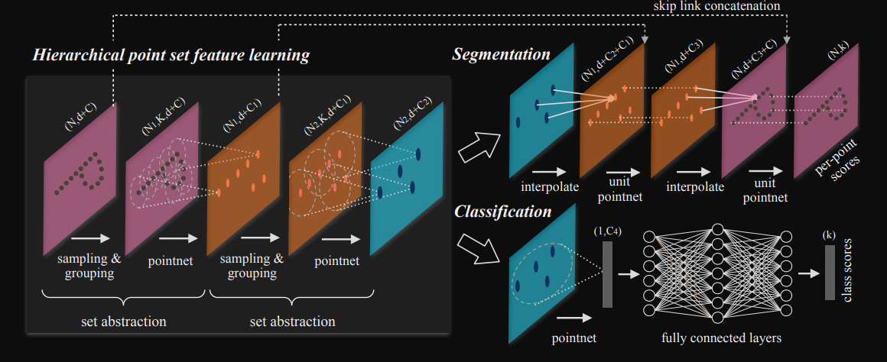
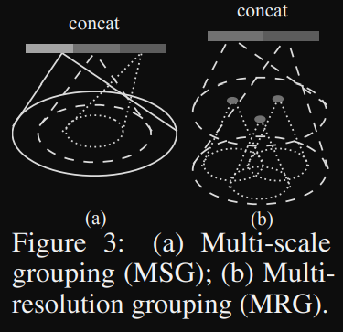
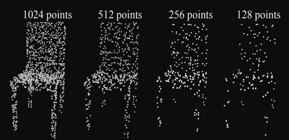
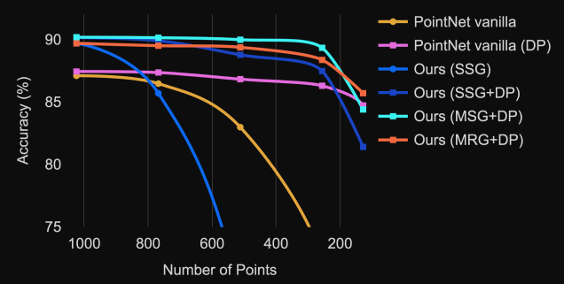

# PointNet++

> PointNet存在的问题是PointNet虽然提取了每个点的局部信息，但是这个局部信息十分有限，只有一个点。PointNet无法捕捉到点附近的局部结构信息，限制了其在细粒度（fine-grained）形状的点云的识别以及复杂场景中的应用。为了解决这个问题，PointNet++采用了一种嵌套式的点云分割方式，PointNet++提取点云特征的方式类似于二维图像使用CNN提取特征，其提取嵌套的邻域特征，使得特征更加丰富，具有更强的表征能力。另外，作者观察到真实采样到的点云的具有不同的稀疏程度，但是训练网络的时候使用的都是一种密度的点云，这就使得网络泛化到不同密度的点云上的能力变差。为了解决这一问题，作者在网络中提出了MSG和MRG去可适应地提取不同密度的的特征。
>
> 另外PointNet中一个点云的全局特征是将所有**单个点**的稀疏高维特征信息的整合，生成的global  feature有限，且损失了一定的信息；PointNet++则是通过多层不断提取点云中嵌套区域的点云的特征，得到点云的global feature，具有更强的表征能力。

## Introduction

- 作者首先介绍了点云，包括其是什么、获取方式和特点。除此之外，作者着重强调了点云的另一个特点——the distance metric defines local neighborhoods that may exhibit different properties，也就是说，一个点周围的点的分布是该点的一个很重要的特征。这个特点很重要，其一是PointNet没有重视这个问题，其二是本文的重点就是针对该特征设计网络结构。

- 作者接下来直接指出了PointNet这一问题：The basic idea of PointNet is to learn a **spatial** encoding of each point and then aggregate all individual point feature to a global point cloud signature，也就是说，PointNet并没有提取到一个点的周围邻域的信息。接下来，作何使用二维图像上使用的CNN说明了global feature更应当是所有点的邻域特征的整合，而不是多有单个点的稀疏特征的组合。

  > 已经证明的是，在CNN中，浅层网络往往用于提取图像的低级语义信息，深层网络通过整合浅层网络提取到的低级信息具备了更强的抽象能力，从而能够提取图像中更抽象信息。

- 下面对比朴素的CNN与PointNet++从而介绍PointNet++的每一个步骤：

  | 步骤           | CNN                      | PointNet++                    |
  | -------------- | ------------------------ | ----------------------------- |
  | 网络的输入     | 固定大小图片             | 坐标归一到0~1的点云           |
  | 提取特征的中心 | 滑动窗口的中心点，有规律 | 随机选取的最远的n个点，无规律 |
  | 提取特征的方法 | 卷积                     | PointNet（不包含T-Net）       |
  
- 对比CNN的传播过程，结合PointNet++的流程图，可以将PointNet++的传播过程总结如下：对于一个输入点云，先将其归一化到所有坐标在0~1之间，然后随机选择n个点作为提取特征的中心点，记录这些中心点的坐标值，使用PointNet提取以这些点为中心固定半径的邻域包含的所有点的特征（这里称之为local feature），得到的结果是这些中心点的坐标值和它们的local feature。随机选取中心点、提取中心点的local feature并组合成一组新的点云的过程称为sampling&grouping ，这个过程可以在点云上进行多次，就像CNN在图像是上进行多层卷积操作一样。
  

## Method and Code

### Hierarchical point set feature learning

Hierarchical point set feature learning是上图的左边模块，其由若干个set abstraction层组成，每个层的任务是提取该层中一组最远点的特征。每个set abstraction层包括三个子层：sampling、grouping、pointnet。

### sampling layer

- 从输入的n个点$\left\lbrace x_1,x_2,...,x_n\right \rbrace$中依据farthest point sampling (FPS) 算法选取$m$个最远点$\left\lbrace x_{i1},x_{i2},...,x_{im}\right \rbrace$，FPS算法的思想是每次选取一个新的点的时候都要保证其与所有已经选了的点的距离和最大。这样做的好处是可以根据输入点云自适应地选取合适的区域提取局部特征，不像图像的卷积网络只能在预设好的几个点提取局部特征。

### grouping layer

- 根据输入点云和sampling layer抽取的$m$个点的坐标，得到$m$个局部点云。输入点云的shape为 $N \times (d\times C)$ ，$N$ 表示点的数量，$d=3$表示坐标维度，$C$表示点的特征维度（代码中显示：输入点云如果包含了点的法向量，则用坐标和法向量作为点云在第一层的特征，$C=6$；如果没有则只用坐标作为特征，$C=3$）。输出$m$个局部点云，shape为$m \times K \times (d+C)$，$K$表示一个局部点云中的点的数量。

  - 作者认为这里选取一个点的邻域时，ball query会比KNN更合理，相比于直接选取点最近的K个点，ball query选取的是一个领域内的最多K个点，其好处为：

    > Compared with KNN, ball query’s local neighborhood guarantees a fixed region scale thus making local region feature more generalizable across space, which is preferred for tasks requiring local pattern recognition (e.g. semantic point labeling).

  - 文中提到不同的局部点云具有不同的$K$并不影响算法的进行，因为一层内所有点的特征维度相同，只要经过PointNet后就可以得到一个相同维度的全局特征向量了。但是在我找到的代码中显示并不是这样，代码固定了每一层中的局部点云包含的点数，在sampling的过程中，如果邻域中的点不够，会用中心点最近的点填充不足的部分。我觉得论文中的这种方式显然更加合理，所找到的代码应该有问题。

- sampling and grouping 过程代码如下：

  ```python
  def sample_and_group(npoint, radius, nsample, xyz, points, returnfps=False):
      B, N, C = xyz.shape # B-batch size, N-points num, C=3
      S = npoint # 需要sampling的点数
      # sampling npoint个点，结果的shape为[B, npoint, C]，C为index的维度，这里为3
      fps_idx = farthest_point_sample(xyz, npoint)
      new_xyz = index_points(xyz, fps_idx) # 通过index得到sampling的点的坐标
      # 查询sampling到的每个点的球邻域内的点的index
      idx = query_ball_point(radius, nsample, xyz, new_xyz) 
      # 通过index查询邻域内的点的坐标，[B, npoint, nsample, C]
      grouped_xyz = index_points(xyz, idx)
      # group到的点减去中心点，即将所有局部点云的中心移动到坐标系原点
      grouped_xyz_norm = grouped_xyz - new_xyz.view(B, S, 1, C) 
      # points表示点云的特征信息，如果不空，则将每个邻域点云坐标后面拼接上对应的特征。
      # new_points作为返回值，包含m个待提取特征的局部点云，每个点包含坐标和特征
      # new_xyz为这些局部点云的中心点坐标，其保存下来的目的是为了知道提取到的每个
      # 局部点云的特征属于哪个位置，同时下一次sampling也需要他们。
      if points is not None:
          grouped_points = index_points(points, idx)
          new_points = torch.cat([grouped_xyz_norm, grouped_points], dim=-1)
      else:
          new_points = grouped_xyz_norm
      if returnfps:
          return new_xyz, new_points, grouped_xyz, fps_idx
      else:
          return new_xyz, new_points
  ```

  - 作者提到，对于每一层的中心点，选取多大的邻域并不容易。按照图像卷积的经验，应当选尽量小的卷积核，叠加更多的卷积层，这样可以在减少参数的同时还能提高CNN的能力。但是作者在文中说，小的邻域在点云中并不能发挥更好的效果，反而会更差：

    > Our experiments on point set data, however, give counter evidence to this rule. Small neighborhood may consist of too few points due to sampling deficiency, which might be insufficient to allow PointNets to capture patterns robustly.

  - 需要注意的是，局部点云并不需要被归一化。

### PointNet Layer

- 这个层就是将sampling & grouping得到的局部点云作为输入，得到输入点云的全局特征向量，对个局部点云提取得到对应的特征向量，最终得到m个特征向量，这m个特征向量对应着在上一段代码中`new_xyz`中的中心点。最终的结果是`new_xyz`中的每个点具有其三维坐标和能够表征其周围特征的特征向量。对应整个sampling&grouping&PointNet的代码如下，29行开始PointNet层的代码：

  ```python
  class PointNetSetAbstraction(nn.Module):
    def __init__(self, npoint, radius, nsample, in_channel, mlp, group_all):
        super(PointNetSetAbstraction, self).__init__()
        self.npoint = npoint # 需要采样的中心点数
        self.radius = radius # 邻域半径
        self.nsample = nsample # 邻域内取多少点
        self.mlp_convs = nn.ModuleList() # 全连接层列表
        self.mlp_bns = nn.ModuleList() # Batch Normalization层
        last_channel = in_channel
        for out_channel in mlp: # 一层一层的全连接层放到全连接层列表中
            self.mlp_convs.append(nn.Conv2d(last_channel, out_channel, 1))
            self.mlp_bns.append(nn.BatchNorm2d(out_channel))
            last_channel = out_channel
        self.group_all = group_all # 是否将输入的整个点云看成一个组
    def forward(self, xyz, points):
        xyz = xyz.permute(0, 2, 1)
        if points is not None:
            points = points.permute(0, 2, 1)
        if self.group_all:
            # 将整个点云看成一组，不用sampling，整个点云提取一个全局特征
            # 可以用在地点云分类网络上
            new_xyz, new_points = sample_and_group_all(xyz, points)
        else:
            # sampling & grouping
            new_xyz, new_points = sample_and_group(self.npoint, \ 
                                    self.radius, self.nsample, xyz, points)
        new_points = new_points.permute(0, 3, 2, 1) # [B, C+D, nsample,npoint]
        # 将每个小点云经过若干层的全连接层，提取特征
        for i, conv in enumerate(self.mlp_convs):
            bn = self.mlp_bns[i]
            new_points =  F.relu(bn(conv(new_points)))
        # maxpooling层
        new_points = torch.max(new_points, 2)[0]
        new_xyz = new_xyz.permute(0, 2, 1)
        return new_xyz, new_points

- `sample_and_group_all`和`sample_and_group`函数会将得到的每个小局部点云减去中心点，将点云的中心点都移动到坐标系中心点。
- 所使用的PointNet不包含T-Net，只包含全连接层和池化层，其中卷积层使用一维卷积进行了代码实现。


### MSG & MRG

- MSG & MRG 是作者为了解决点云稠密不均的问题，问题在于 “Features learned in dense data may not generalize to sparsely sampled regions”。**这里表达的很奇怪，我不明白的是：点云稠密不均到底影响的是模型的效果还是影响到作者这里说的不同密度点云特征的泛化？为什么要在不同密度的特征为什么要泛化？**

- 接下来作者给出的解释就就很明白了，点云稠密不均的问题在于，对于一个比较稠密的点云，我们希望将感受野（邻域范围）设置的小一点，这样我们可以更距离地观察稠密区域的细节；但是对于稀疏的点云，如果我们使用同样小的感受野去观察点云，所观察到的点会很少，可能不足以反映中心点的局部特征，所以我们会希望有一个较大的感受野。作者为此提出了 “density adaptive Point Net layers”。

- 真正的PointNet++  **=**  多层级的特征提取网络  **+**  密度自适应的PointNet层

  

- Multi-scale grouping（MSG）：MSG通过拼接不同尺度的感受野的特征规避密度带来的问题，如果点云比较稀疏，则大的感受野的特征会更具有表征能力；如果点云比较密集，则小的感受野会提取到点云的细节信息，不至于忽略掉点云的细节。如上图（a）所示。对当前层的每个中心点，取不同radius的query ball，可以得到多个不同大小的同心球，也就是得到了多个相同中心但规模不同的局部邻域，分别对这些局部邻域表征，并将所有特征拼接。

- Multi-resolution grouping（MRG）：MRG通过结合由小到大提取的特征（特征一）和笼统的整体特征（特征二）规避点云密度带来的问题，如果点云比较稀疏，则特征二会提取到更有用的全局特征；如果点云比较稠密，则特征一中由于考虑了更小的邻域而具有点云的细节信息。如上图（b）所示。MRG中总的特征包含两个子特征，

  - 左边子特征是上一层特征提取得到的一些点的局部特征的加和。
  - 右边子特征是对整个点云进行一次特征提取。
  - 举个例子：对于网络的第二组sampling & grouping & PointNet的输入点云，特征一是这些输入点云的总和（我认为还应该求个平均），特征二就是将输入点云经过完整的sampling & grouping & PointNet过程得到的输入点云的特征。

- random input dropout（DP）：为了训练网络在不同密度的点云上的表现，作者还进行了数据增强。数据增强的方式是对输入点云做dropout，对于输入点云，每个点都有 $\theta$ 的概率被舍弃，$\theta$ 从 $[0, 0.95]$中均匀采样得到。这样就可以得到的点云就具有了不均匀的密度，可以更好地训练网络的表现。注意，dropout操作仅需要在训练阶段使用。下图为dropout的效果。

  

- 比较MSG和MRG：

  - 从上面的描述就可以看出，MSG需要对点云进行三次PointNet，但是MRG仅需要一次，所以MRG更加节省算力。

  - 下图为SSG、MSG、DP的实验效果对比，最好的结果是MSG+DP的组合，SSG表示不使用MSG和MRG的PointNet++网络。可以看到，虽然MRG更剩算力，但是其效果还是会比MSG差一些，有所得必有所失。

    

    - performance: MSG > MRG > SSG
    - performance: DP > no DP
    - performance: PointNet > PointNet(vanilla)，此图未说明，Table 2说明了。

### Point Feature Propagation

- 

- 基于PointNet++的分类网络比较简单明了，即先经过两层set abstraction，将得到的点云（蓝色）作为一个group，不经过sampling，直接使用PointNet提取整个点云的特征向量，并最终送入全连接层进行分类。
- 基于PointNet++的分割网络则需要想办法将因为set abstraction被subsample的点云再扩增回去，由于要确保输入点云的每个点都需要被分类，则自然需要得到每个点云的特征向量用于分类。这里作者使用的方式是使用最后一层set abstraction中sampling到的中心点的特征向量经过多次向上插值获得其他点的特征向量，在插值扩增点云特征的同时也将set abstraction得到的中间结果做跳跃连接，使得扩增的点云特征更加准确。具体来说：
  - Segmentation网络的输入是经过两次set abstraction的稀疏点云，其中的每个点都包含其邻域特征。
  - 第一次需要被插值的点是第一次set abstraction过程中sampling的点。
  - 对于需要被插值的点$p$，找到其$K$个最近的点 $p_i(i=1,2,...,k)$，并且$p_i$都是输入点云中的点，即这些点的特征已知，点$p_i$的权重是该点到$p$点的距离的导数除以$K$个点的权重总和，$p$点的特征为$K$个点的特征的加权和。
  - 插值完成以后，得到的点云与第一次set abstraction的结果大小相同，将相同点的特征前后拼接在一起。
  - 可以发现，插值得到的特征具有点的更高层次的特征，其感受野更大，第一次set abstraction得到的点的特征包含更丰富的细节信息。接下来经过一个unit PointNet（将两种特征融合？）。所谓的unit PointNet就是对每个点的特征经过几层全连接层，结果的点数保持不变，每个点的特征发生变化。
  - 以上就进行了一次特征的插值，网络还进行了一次插值，从而将点的数量恢复到原来点云的数量。

