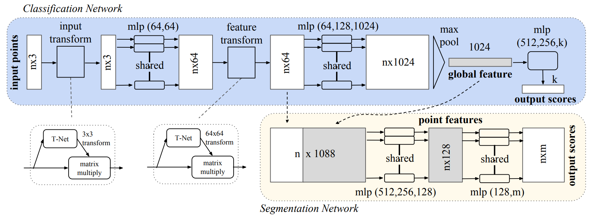

# PointNet

> 点云不规则且具有无序性，而传统的卷积网络需要十分整齐的数据作为输入，比如图像或者体素（voxel），很难直接将点云作为神经网络的输入。之前的大部分工作将点云转换成3D voxel或者一组多视角图片进行深度学习。PointNet 是第一个直接将点云作为神经网络的输入的工作，其在网络设计中考虑到了点云的无序性的问题。
>
> 点云的无序性指的是点云不因为其中的点的索引顺序的改变而改变。与图像不同的是，图像的所有像素点的顺序是不可交换的，而点云中的点是一系列三维坐标的集合。

## Introduction

- 作者首先分析了目前应用于深度学习的三维数据的特点：

  - Voxel and Image：过去的很多的研究都是将点云转换成这两种形式进行深度学习，但是不可避免地增大描述同一个物体所需要的的数据量（unnecessarily voluminous），并且还会引入quantization artifacts（量化后产生的伪影？），其会模糊数据的原始不变性（natural invariances）。
  - Mesh：点云相对于mesh更加简单和统一。点云作为网络的输入仅是一些相同维度的点，但是mesh还要考虑线和面，会更加复杂。
  - Point Cloud：点云作为网络的输入，要求网络能够处理点云的无序性和点云的刚体变换不变性（点的特征信息不受点云的刚体变换而变换）。由于点云中的点交换顺序后，神经网络对于点云的预测信息不变，作者认为最终拟合的函数需要是一个对称函数（symmetric function）。

- PointNet的输入是点云中点的坐标信息（其他特征信息如果有也可以作为输入），所有输入点依次经过若干个全连接层提取每个点的局部特征，所有点在网络的同一层上使用的全连接层是相同的，之后再将所有点的局部特征经过一个最大池化，就可以得到所有点的全局特征，网络中得到的点云的局部特征和全局特征可以作为点云classification和segmentation的输入。

  - PointNet的结构非常简单，但是其却可以解决点云的无序性。最大池化是保证网络拟合的函数是对称函数，作者在文中提到了PointNet 学习到的东西为：

    > Effectively the network learns a set of optimization functions/criteria that select interesting or informative points of the point cloud and encode the reason for their selection.（没看懂）

  - 问：**只有最大池化有效吗？平均池化是否也可以呢？**

    - 并不是，平均池化也能够处理无序点云，但是作者在文中实验表明，平均池化的效果没有最大池化好。所以我们可以认为PointNet中的池化层就是最大池化。

- PointNet不仅可以处理点云的无序性，并且也可以处理点云的刚体变换不变性。由于点云中每个点在提局部特征时是分别提取的，所以在最大池化之前，点与点直接没有产生互相影响，这就说明了我们可以在提取点的局部特征的过程中加上一些对点云产生刚体变换的操作，并期望网络能够将输入点云“转”到一个“合适”的角度，通过这种方式规范化点云。
  - **为什么PointNet++中没有继续使用这种思想？**
  - 因为对PointNet++的效果提升不明显。
- 作者在补充材料中证明了PointNet 可以近似任何连续的集合函数，并且从理论上证明了对于网络对于输入点云的小扰动具有较强的鲁棒性。更有趣的是，实验表明，PointNet 试图去提取输入点云的骨架信息（实验是如何设计的？）。

## Architecture

- 作者针对了点云分类与点云分割两种任务进行网络设计
  - 分类任务：输入为点云的坐标信息，也可以包括点的其他特征信息，如颜色、法向量等。输出为一个向量，向量的长度为点云类别数，向量中的第$i$个值对应着该点云属于第$i$个类别的概率。
  - 分割任务：输入与分类任务相同。输出为以$n \times m$的矩阵，点云中的点来自于$m$个类，矩阵中的每一行为该点的分类信息。
- PointNet 的总体框架如上图所示，$n \times 3$的点云首先经过一个Transformation Net得到一个可以将输入点云转换到一个“合适”角度的$3 \times 3$的刚体变换矩阵，将点云的每个点与转换矩阵相乘得到转换后的点云，仍然为$n \times 3$的点云；接下来是两个节点为$64$的全连接层，所有点共享两个全连接层的参数，全连接层的输出为$n \times 64$的点云，继续经过一个Transformation Net得到一个$64 \times 64$的刚体变换矩阵，同样使用该矩阵对点云做刚体变换，输出的点云仍然为$n \times 64$的点云；将点云继续经过三层全连接层，节点数分别为$64$、$128$、$1024$，最终得到一个$n \times 1024$的点云，每个点的特征有$1024$维，将其经过一个最大池化操作即可得到一个$1024$维的特征向量，该特征向量被称为global feature，具有点云的整体特征。
- 分类网络的目的是得到整个点云的分类信息，所以直接将global feature作为分类信息源，经过三个全连接层逐步将特征从$1024$将到类别数$k$。
- 分割网络需要得到每个点的分类信息，所以不仅需要点云的global feature，还需要每个点的local feature。所以分割网络将中间的$n \times 64$的点云的每个点的局部特征的后面加上$1024$维的全局特征，这样每个点不仅有其局部的特征，也有整个点云的全局特征信息，足以分辨每个点的类别了。将拼接后的点云经过若干层参数共享的全连接层，将每个点的维度信息降到$m$，最终得到$n\times m$的分割结果。

> 实际上只有输入才能被称为点云，每个点经过全连接网络提取到高维特征后不一定还能被称为点云。但是由于提取特征的操作仅仅在每个点上进行，可以认为仅仅是将每个点换了一种表示方式，所以这里依然称它们为点云。

- T-net (Transformation Net) 初看起来比较难理解，其实就把它看成一个输入为点云，输出为可以将该点云变换到一个便于网络提取信息的角度的变换矩阵。T-net在形态上就是一个不包含T-net的PointNet，具体来说，T-net中首先对输入点云经过若干层的参数共享的全连接层，然后经过一个max pooling层，最后将得到的global feature通过若干层全连接层降到$9$维（$64\times64$维），在将这$9$个（$64\times64$个）数拼成一个转换矩阵.

